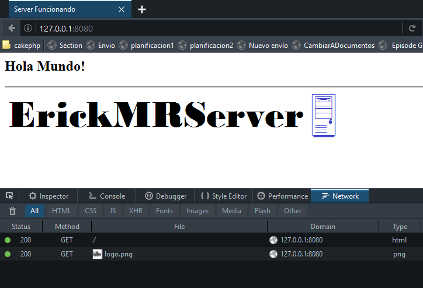
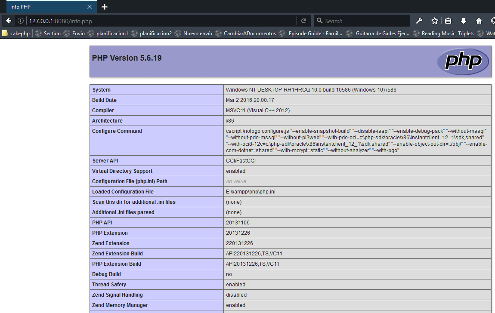
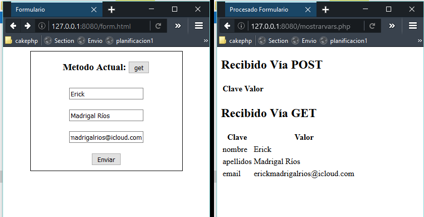
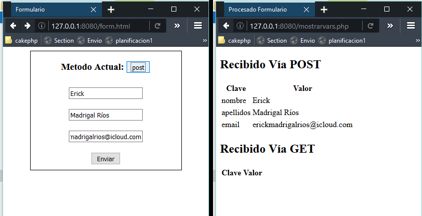

# Resultados de los casos de prueba

1-)
```
HTTP/1.1 200 OK
Content-Type: text/html; charset=utf-8
Date: Fri, 15 Apr 2016 10:05:09 GMT
Server: ErickMRServer/0.5
Content-Length: 201


<html>
    <head>
        <title>Server Funcionando</title>
    </head>
    <body>
        <h2>Hola Mundo!</h2>
        <hr />
        
    </body>
</html>
```
```GET, #, 127.0.0.1, 127.0.0.1, , /, ```

2-)
```
HTTP/1.1 406 Not Acceptable
Content-Type: text/html; charset=utf-8
Date: Fri, 15 Apr 2016 10:06:37 GMT
Server: ErickMRServer/0.5
Content-Length: 0
```
```GET, #, 127.0.0.1, 127.0.0.1, , /form.html, ```

3-) 

```
Warning: Setting custom HTTP method to HEAD may not work the way you want.
HTTP/1.1 200 OK
Content-Type: text/html; charset=utf-8
Date: Fri, 15 Apr 2016 10:07:38 GMT
Server: ErickMRServer/0.5
Content-Length: 201

curl: (18) transfer closed with 201 bytes remaining to read
```
```HEAD, #, 127.0.0.1, 127.0.0.1, , /index.html,```

4-) 
```
HTTP/1.1 404 Not Found
Date: Fri, 15 Apr 2016 10:08:15 GMT
Server: ErickMRServer/0.5
Content-Length: 0
```
```GET, #, 127.0.0.1, 127.0.0.1, , /archivonoexistente.html, ```

5-)
```
HTTP/1.1 200 OK
Content-Type: text/html; charset=utf-8
Date: Fri, 15 Apr 2016 10:05:09 GMT
Server: ErickMRServer/0.5
Content-Length: 201

<html>
    <head>
        <title>Server Funcionando</title>
    </head>
    <body>
        <h2>Hola Mundo!</h2>
        <hr />
        
    </body>
</html>
```
```POST, #, 127.0.0.1, 127.0.0.1, , /index.html,  || POST-> |mensaje=Hola+Mundo```

6-) 
```
HTTP/1.1 200 OK
Content-Type: text/html; charset=utf-8
Date: Fri, 15 Apr 2016 10:05:09 GMT
Server: ErickMRServer/0.5
Content-Length: 201

<html>
    <head>
        <title>Server Funcionando</title>
    </head>
    <body>
        <h2>Hola Mundo!</h2>
        <hr />
        
    </body>
</html>
```
```
GET, #, 127.0.0.1, 127.0.0.1, , /index.html, name=Erick
```

7-)



```
GET, 1460717171, 127.0.0.1, 127.0.0.1, , /, 
GET, 1460717171, 127.0.0.1, 127.0.0.1, http://127.0.0.1:8080/, /img/logo.png, 
```

8-)



9-)



